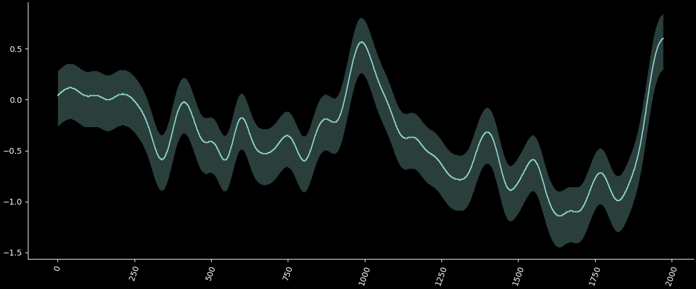

This graph overlays data from 18 different paleoclimate studies and was included in the IPCC's Fifth Assessment Report. It has served as ammunition to attack climate science on blogs, forums, and political discourse. 

### "See, it was warmer in the past!" 
&nbsp;

The light blue line is CL12loc. Here is a plot of that data by itself. The bands represent the upper and lower 2.5% quartile from the original data.

1. The *rate of change* is one of the most important causes of alarm in
climate science. From the graph we see that the sustained rate of change over the last century is much greater than what was seen in the 900s
2. The warmest point on the graph is actually slightly cooler than today
3. In the combined plot, all studies show an increase in cross-correlation over the last century

&nbsp;

Paleoclimatology is complicated and has a high degree of uncertainty. This data set relied on 91 proxies - not direct measurements. Temperatures have to be reconstructed from the available data.

Read about the original study here: https://www.clim-past.net/8/765/2012/cp-8-765-2012.pdf

More: http://www.ncdc.noaa.gov/global-warming/last-2000-years
