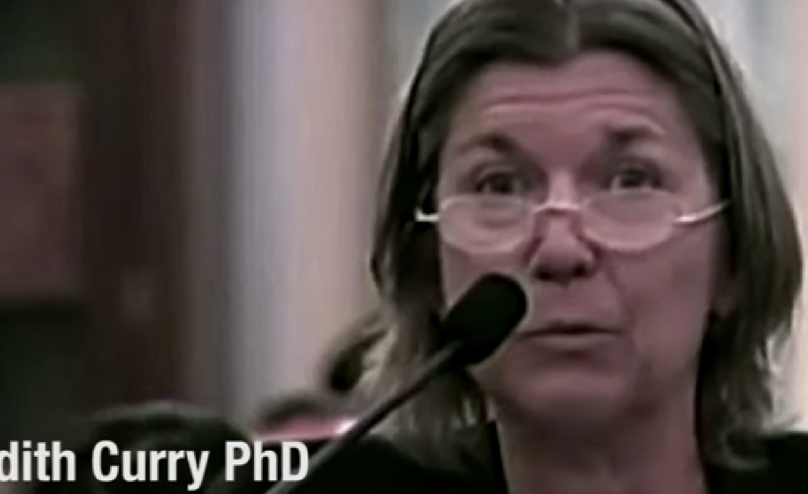

published: false
---
{ width=200 } "We need to look at the satellite data. I mean this is the best data that we have" - Judith Curry, PhD
https://www.youtube.com/watch?v=5KVTmo2Vxnk&feature=youtu.be&t=7368

regarding judy curry 35:45
 
"Human caused climate change is a theory in which the basic mechanism is well-understood but whose magnitude is highly uncertain

No one questions that surface temperatures have increased overall since 1880 or that humans are adding carbon dioxide to the atmosphere or that carbon dioxide and other greenhouse gases have a warming effect on the planet

however there is considerable uncertainty and disagreement about the most consequential issues, whethrer the warming has..." etc 
