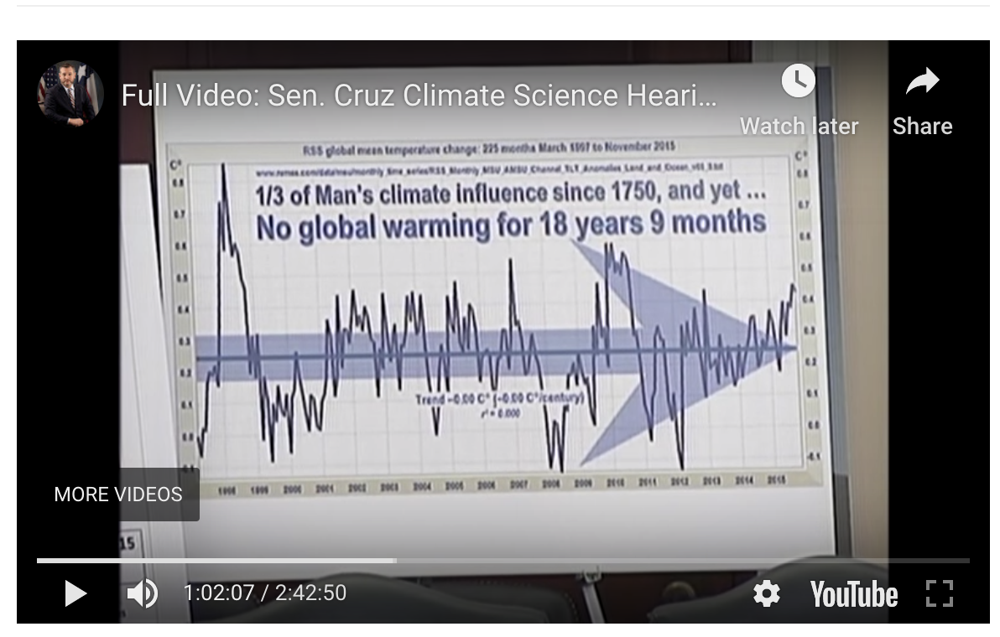
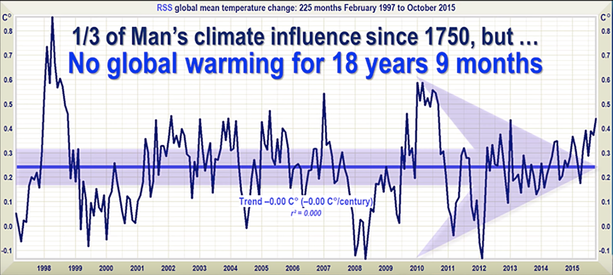
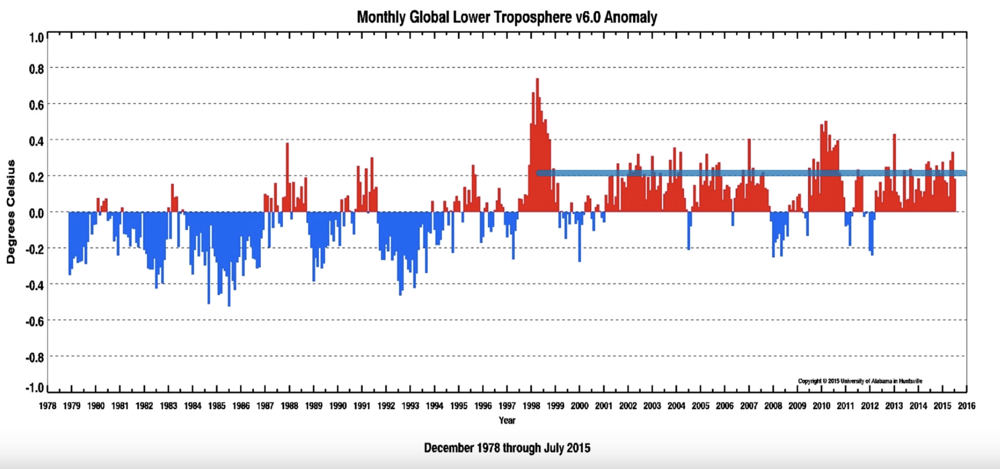
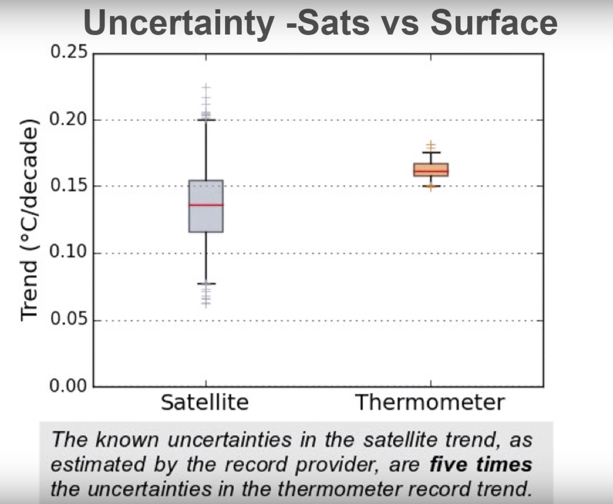
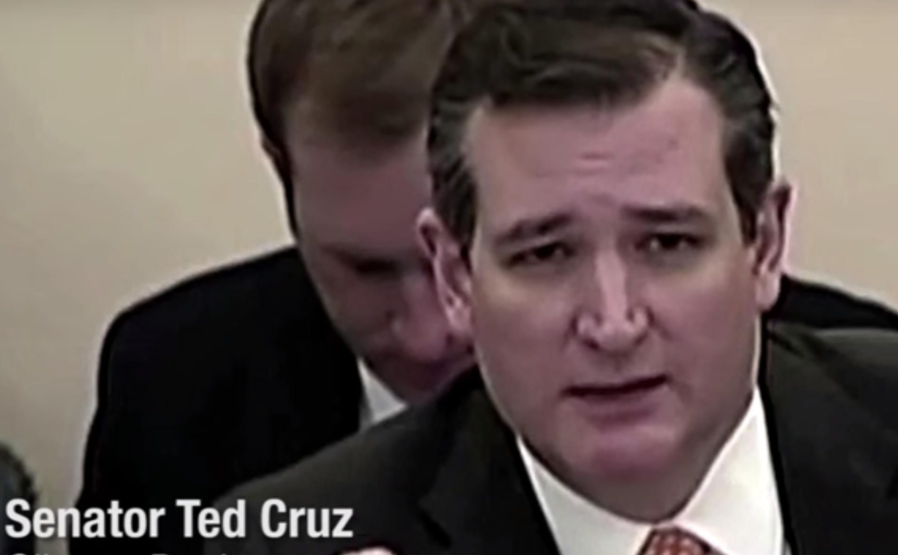
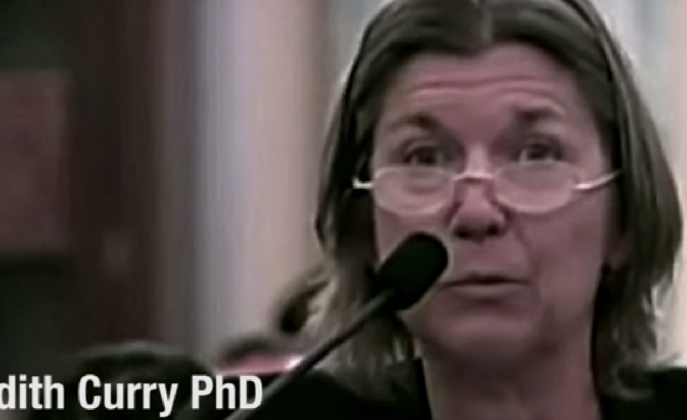

"I understand that the global warming alarmists don't want to talk about the satellite data" - Senator Ted Cruz (https://www.youtube.com/watch?v=5KVTmo2Vxnk&feature=youtu.be&t=3803)

<a href=http://www.remss.com/about/profiles/carl-mears/>Dr. Carl Mears</a>, senior scientist on the Remote Sensing Systems (RSS) project, talking about his satellite data, the challenges, and Senator Ted Cruz's misuse of the data -- Part 1 https://www.youtube.com/watch?v=7UyAOYoIifo and Part 2 https://www.youtube.com/watch?v=8BnkI5vqr_0

"He \[Cruz\] really likes to focus on the part, that's really after 1998" ... "and if you look at that he's technically correct, there is no warming during that period in my dataset" ... "he starts at that time for a very specific reason and that's because there's a huge El Niño event" ... "which puts a huge spike in the global temperature" 

"Senator Cruz focuses on one data set, mine, from one type of instrument satellite, and he ignores all the other evidence"

Here's Cruz's shamelessly cherry-picked data, from https://youtu.be/5KVTmo2Vxnk?t=3708

{ width=500 }

And closer

{ width=500 }

That leading spike during El Niño sure makes it appear like there's no warming...

Here's a chart of the RSS data that includes everything that Cruz or one of his collaborators chose not to present. 1998, where Cruz's chart starts, is in the middle... where the climate got noticeably warmer.

{ width=500 }

<h3>"The satellite data are the best data that we have" - Senator Ted Cruz</h3> 

In part 2 of the interview above, Dr. Mears points out that his RSS data shows a wide degree of uncertainty compared to surface measurements, which can also be seen in the RSS charts above.

"If you do an uncertainty analysis on this 1996 to the present period that we're discussing then you find that the trend could be anywhere from -1/800 to +1/800 of a degrees C per decade"

As the satellites circle the earth, year after year, the precise times when they take a measurement over a given location drifts. This is referred to as diurnal drift and is one of the reasons why the datasets have had to be adjusted.

Furthermore, the data has not been collected consistently by just one satellite. In fact there have been 13 different satellites, none of which have been active throughout the entirety of the project. When a new satellite is launched, they have to cross calibrate all of the measurements to get a consistent picture.

Even orbital decay has to be accounted for. 

So is the sattelite data better really the best, as Senator Cruz claimed? Here's a comparison of uncertainty between both types

{ width=500 }

Dr. Mears has been forthright about these challenges. It's a shame we can't expect a Senator to not show the same integrity.

# Summary
At best, Cruz and his cohorts could have used the data to argue that the results are not conclusive. Instead they made the choice to mislead the public.

{ width=200 } 

{ width=200 } "We need to look at the satellite data. I mean this is the best data that we have" - Judith Curry, PhD
https://www.youtube.com/watch?v=5KVTmo2Vxnk&feature=youtu.be&t=7368

regarding judy curry 35:45
 
"Human caused climate change is a theory in which the basic mechanism is well-understood but whose magnitiure is highly uncertain

No one questions that surface temperatures have increased overall since 1880 or that humans are adding carbon dioxide to the atmosphere or that carbon dioxide and other greenhouse gases have a warming effect on the planet

however there is considerable uncertainty and disagreement about the most consequential issues, whethrer the warming has..." etc 

Dr. Happer
39:20
40:55
"Carbon dioxide is not a pollutant
"The plants are having a hard time since the o2 levels are too high
Claims geologic history shows co2 level 3 or 4 times higher than what they are now

left off 1hr:38

Perhaps the saddest part, you can still watch the hearing on Ted Cruz's webpage 
https://www.cruz.senate.gov/?p=press_release&id=2548

Perhaps anything is possible if you cherry-pick hard enough.

Mafia: https://www.youtube.com/watch?v=bOHrYY3yAGE

for args:
"scientists predict that arctic will be ice free in the summer of 2013" - john kerry
https://youtu.be/5KVTmo2Vxnk?t=8312