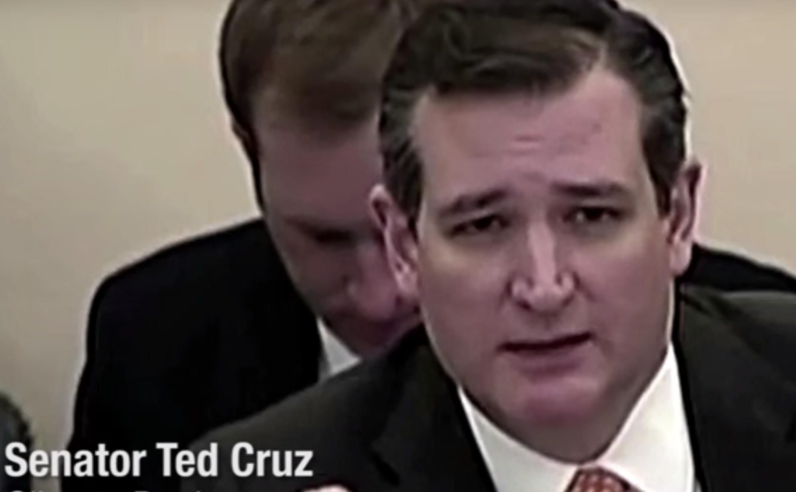
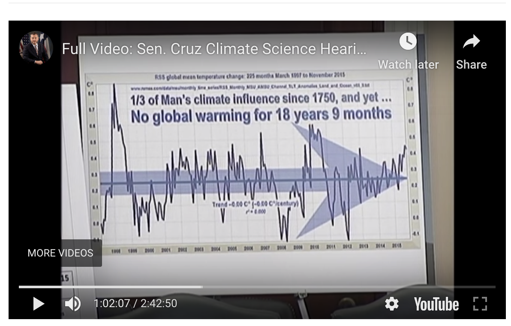
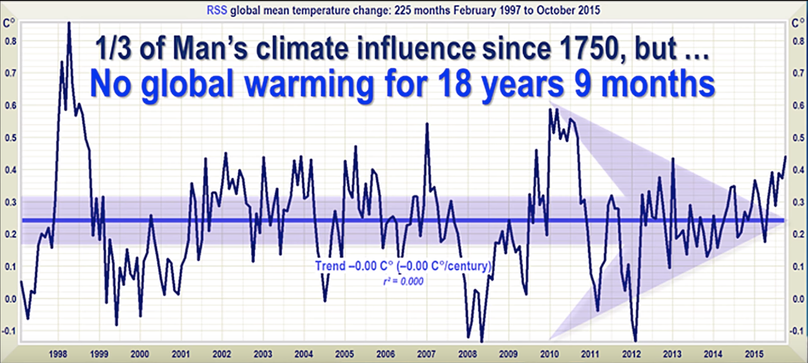
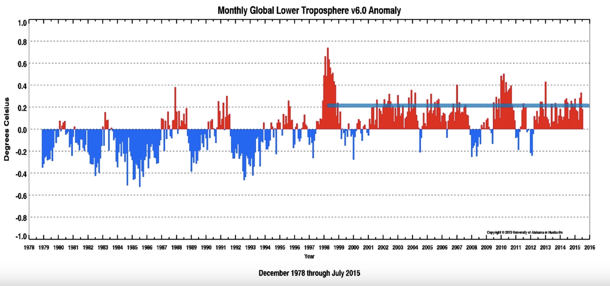
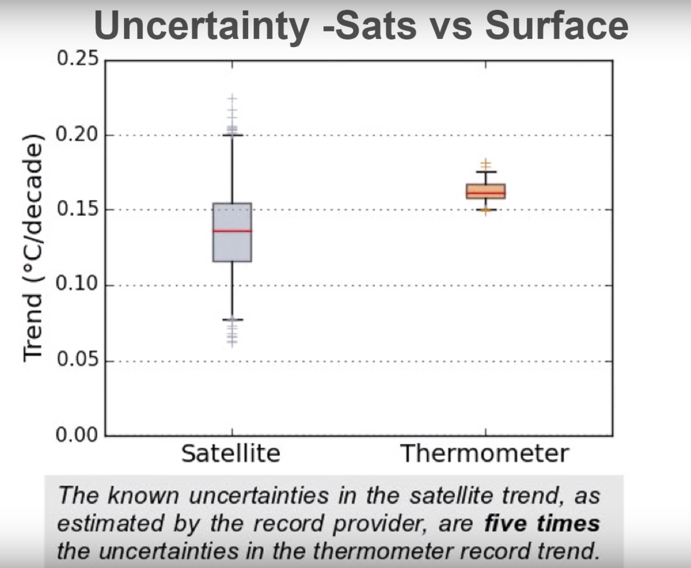

import YouTube from '~/components/YouTube.vue'
import SideSide from '~/components/SideSide.vue'
import Quote from '~/components/Quote.vue'

<Quote quote="Facts and evidence matter" source="Senator Ted Cruz"/>

In 2015, Senator Ted Cruz held a hearing. 

It contained a some strongly worded claims, and a chart of some satellite data from the Remote Sensing Systems (RSS) project. The chart indicated that there has been no global warming for 18 years. The message stuck and to this day it is still referenced in denialist circles and right-wing forums.

I did some research. It was garbage. The data was verifiably cherry-picked. Some statements were bald-faced lies. At times Senator Cruz seemed more interested in attacking Democrats than staying on topic. Also in attendance was known denialist Dr. William Happer. Dr. Happer wanted to talk about plants. Not data, nor the risk of climate change, but how good CO2 is for plants.

While the hearing contained a number of telling gems, I'm only going to address a couple.

<v-divider class="ma-10"/>

<SideSide lwidth="2" rwidth="8">
  <template v-slot:left>
    

    
    

  </template>
  <template v-slot:right>
    <a href="https://www.youtube.com/watch?v=5KVTmo2Vxnk&feature=youtu.be&t=3803"><h3>"I understand that the global warming alarmists don't want to talk about the satellite data"</h3></a> - Senator Ted Cruz
  </template>
</SideSide>

You understand wrong, Senator Cruz

The person chiefly responsible for that data is <a href=http://www.remss.com/about/profiles/carl-mears/>Dr. Carl Mears</a>. Dr. Mears is a senior scientist on the Remote Sensing Systems (RSS) project. In a two part interview, Dr. Mears talks about the challenges in collecting the data, its high uncertainty, and explains how <i>his</i> data was misrepresented by Senator Cruz.

<SideSide>
  <template v-slot:left>
    <h3>Part 1</h3>
    <YouTube path="https://www.youtube.com/embed/7UyAOYoIifo"/>
  </template>
  <template v-slot:right>
   <h3>Part 2</h3>
   <YouTube path="https://www.youtube.com/embed/8BnkI5vqr_0"/>
  </template>
</SideSide>

 
"He really likes to focus on the part, that's really after 1998" ...  "because there's a huge El Niño event" ...  "which puts a huge spike in the global temperature" - Dr. Mears

Also known as: cherry-picking.

Here's the data Cruz presented in the hearing, starting in 1998 with El Niño

[Here's where it starts in the hearing](https://youtu.be/5KVTmo2Vxnk?t=3709)

Here's a cleaned up version of that chart

And here's a chart of the entire dataset. The subset that Senator Cruz chose to use starts in the middle

 
"Senator Cruz focuses on one data set, mine, from one type of instrument satellite, and he ignores all the other evidence"- Dr. Mears
 

But the problem wasn't just Cruz's chart.

<SideSide lwidth="2" rwidth="8">
  <template v-slot:left>
    

    
    

  </template>
  <template v-slot:right>
    <h3>"The satellite data are the best data that we have"</h3>- Senator Ted Cruz
  </template>
</SideSide>

In part 2 of the interview above, we learn that Dr. Mears's data shows a wide degree of uncertainty compared to surface measurements.

<Quote quote="If you do an uncertainty analysis on this 1996 to the present period that we're discussing then you find that the trend could be anywhere from -1/800 to +1/800 of a degrees C per decade" source="Dr. Mears"/>

And it's no secret these challenges are real. There are multiple papers published on the topic. In fact, here is a comparison of uncertainty between both satellite and ground measurements from Part 2 of the interview:

So why did Senator Cruz claim the satellite data is the best we have?

But it was more than just Senator Cruz. Late in the hearing, Dr. Happer, <a href="https://youtu.be/5KVTmo2Vxnk?t=9521">weighed in with the following:</a>

<Quote quote="I just want to make one response about satellite temperature measurements. They measure temperature the same was as hospitals do today..." source="Dr. Happer"/>

He goes on to explain that hospitals and satellites both measure temperature with infrared radiation. It's a disingenuous false equivalence. Again, see the graph of uncertainty above.

<v-divider class="ma-10"/>

# Summary
At best, Cruz and his cohorts could have used the data to argue that the results *from the satellite data* are not conclusive. Instead they chose to misrepresent the facts, the science, and the data.

<Quote quote="Facts matter. Science matters. Data matter" source="Senator Cruz"/>

...then why do you still have the <a href="https://www.cruz.senate.gov/?p=press_release&id=2548">press release</a> on your page, and why haven't you issued a correction, Senator Cruz?

If you would like a more technical discussion, I encourage you to read <a href="https://skepticalscience.com/Response-Data-or-Dogma-hearing.html">Skeptical Science's</a> excellent response to the hearing.
